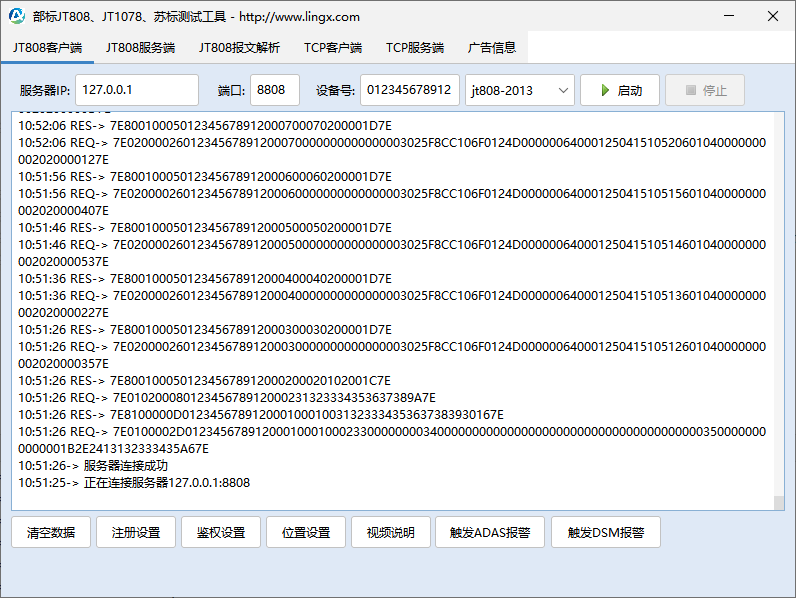

# jt808+jt1078+苏标主动安全终端设备模拟器

除了支持终端设备模拟器外，还支持JT808服务端工具、TCP服务端/客户端功能、JT808报文解析。

# 协议支持
|协议名称|版本| 是否支持 | 备注           |
|---|---|------|--------------|
|JT/T 808|2011| 支持   |
|JT/T 808|2013| 支持   |
|JT/T 808|2019| 支持   |
|JT/T 1078|2016| 支持  |     |
|T/JSATL 12(主动安全-苏标)|2017| 支持  |  |

# 代码仓库
* Gitee仓库地址：[https://gitee.com/lingxcom/jt808-client](https://gitee.com/lingxcom/jt808-client)
* Github仓库地址：[https://github.com/lingxcom/jt808-client](https://github.com/lingxcom/jt808-client)

# Java入口类
com.lingx.jtools.ui.JttoolsFrame

# 基于swing开发的操作界面

